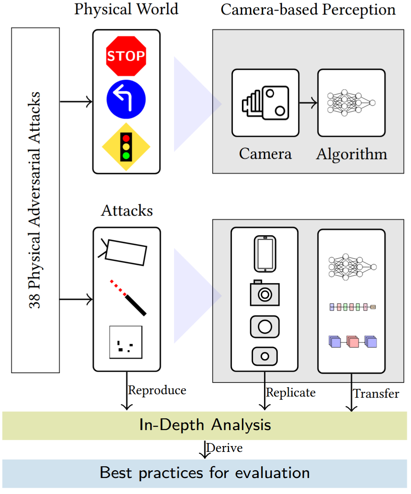

# R+R: Physical Adversarial Attacks Against Camera-based Perception in Autonomous Vehicles - Do They Really Matter?

This code belongs to our work **R+R: Physical Adversarial Attacks Against Camera-based Perception in Autonomous Vehicles - Do They Really Matter?**, where we reproduce, replicate, transfer, and repeat multiple physical adversarial attacks against camera-based perception in autonomous vehicles.

## Content
* [Attacks](./Attacks/): Contains code to run the investigated attacks. It mostly contains instructions, patch files, and environment descriptions to run the original attacks. **Important note:** We are not the original authors of the attacks. Please refer to the respective description in each attack folder for more details and links to the original source code of the authors.
* [Utilities](./Utilities/): Contains utility tools to work with images and run inference of specific machine learning models to reproduce our results.
    * [Utilities/ML_Models](./Utilities/ML_Models/): Code to run different pretrained PyTorch models.
    * [Utilities/Utils](./Utilities/Utils/): Tools to crop images and place digitally crafted adversarial images